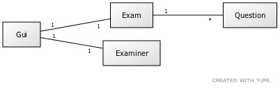
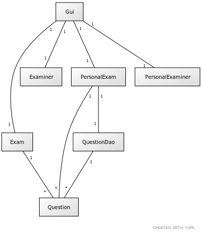
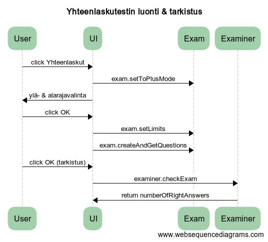
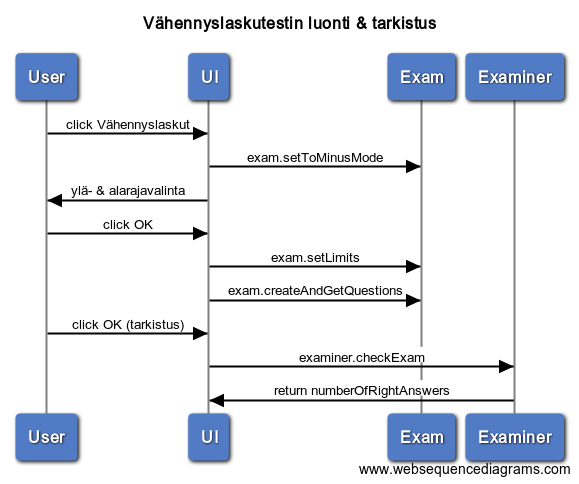
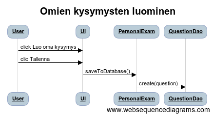

# Arkkitehtuurikuvaus

## Rakenne

## Sovelluslogiikka

### Päätoiminnallisuudet

#### Yhteen- ja vähennyslaskutestin luonti & tarkistus

Seuraavissa sekvenssikaavioissa on kuvaus siitä, kuinka sovellus luo yhteen- ja vähennyslaskutestin 
ja tarkistaa ne.

#### Omien kysymysten luominen

Omien kysymysten luominen ja tallentaminen tietokantaan tapahtuu ylläolevan sekvenssikaavion mukaisesti.

