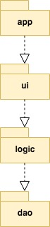

# Arkkitehtuurikuvaus

## Rakenne

Sovelluksen pakkausrakenne on seuraava: 

- Pakkaus _app_ sisältää sovelluksen käynnistävän _Main_ -luokan
- Pakkaus _ui_ sisältää sovelluksen graafisen käyttöliittymän.
- Pakkaus _dao_ sisältää pysyväistallennuksesta huolehtivan koodin.
- Pakkaus _logic_ sisältää sovelluslogiikan.

## Käyttöliittymä

Graafisen käyttöliittymän ohjelmakoodi löytyy sovelluksen luokasta ui.Gui. Käyttöliittymä on eristetty sovelluslogiikasta ja tietokannan käsittelystä. Käyttöliittymästä annetaan parametreina tietoa sovelluslogiikan metodeille. 

Data Access Object -mallin ansiosta käyttöliittymästä ei kutsuta tietoa tallettavia tai lukevia metodeita. Näille toiminnoille on luotu omat metodit sovelluslogiikkaan. 
Kun käyttäjä haluaa esimrkiksi tallentaa kysymyksen, hän painaa _Tallenna_ -nappia, jolloin käyttöliittymä kutsuu 
sovelluslogiikan _PersonalExam_ -luokan metodia _saveToDatabase_.
Metodi pyytää parametreina käyttäjän tekstisyötteet, ja huolehtii niiden siistimisestä sekä 
lisää ne kysymys-vastaus -parina tietokantaan sopivaa dao -metodia kutsumalla. 
Tämän jälkeen metodi viestii käyttöliittymälle tallentamisen onnistumisesta, tai välittää virheviestin.

Käyttöliittymä sisältää seitsemän erilaista näkymää:

- Aloitusnäkymä, jossa käyttäjä voi valita, mitä toiminnallisuutta lähtee harjoittamaan.
- Yhteenlaskukokeen asetusten valintaan tarkoitettu näkymä.
- Vähennyslaskukokeen asetusten valintaan tarkoitettu näkymä.
- Yhteenlaskujen harjoitusnäkymä.
- Vähennyslaskujen harjoitusnäkymä.
- Omien kysymysten luontiin tarkoitettu näkymä.
- Oman harjoituksen harjoitusnäkymä.

Jokainen näkymä on toteutettu omana Scene -olionaan. Näkymät ovat vuorollaan sijoitettuna sovelluksen stageen. 

## Sovelluslogiikka

Sovelluslogiikan päätoiminnalisuuksista vastaa kokeiden luontiin tarkoitetut luokat _Exam_ ja _PersonalExam_. 
Luokka _Exam_ huolehtii yhteen- ja vähennyslaskutestien luonnista ja niiden asetusten muokkaamisesta. _PersonalExam_ 
puolestaan viestii luokan _QuestionDao_ kanssa, 
jolloin se on mukana kysymysten tallentamisessa sekä kysymysten palauttamisessa ui:lle. 

Luokat _Examiner_ ja _PersonalExaminer_ huolehtivat kokeiden tarkistamisesta. 
Molemmista luokista löytyy kokeiden tarkistamiseen tarkoitettu metodi _checkExam_, joka palauttaa käyttöliittymälle oikeiden vastausten lukumäärän. 

### Päätoiminnallisuudet

#### Yhteen- ja vähennyslaskutestin luonti & tarkistus

Seuraavissa sekvenssikaavioissa on kuvaus siitä, kuinka sovellus luo yhteen- ja vähennyslaskutestin 
ja tarkistaa ne.

## Tietojen tallennus

Pakkauksen _dao_ luokka _CreateDatabase_ luo uuden tietokannan sovelluksen ensimmäisellä käynnistyskerralla. 
Luokka _QuestionDao_ huolehtii kysymysten tallennuksesta ja tietokannasta lukemisesta.
Luokat noudattavat Data Access Object -suunnittelumallia. 

### Tietokanta
 
Tietokantaan tallennetaan kysymys-vastaus -pareja kysymysten luontiin tarkoitetussa näkymässä.
Tietokantaan voidaan tallentaa dataa ja sieltä palautetaan lista kysymyksiä.

### Omien kysymysten luominen

Omien kysymysten luominen tietokantaan tapahtuu allaolevan sekvenssikaavion mukaisesti.

