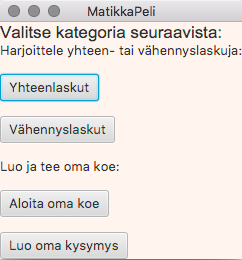
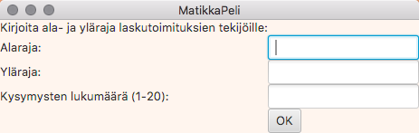
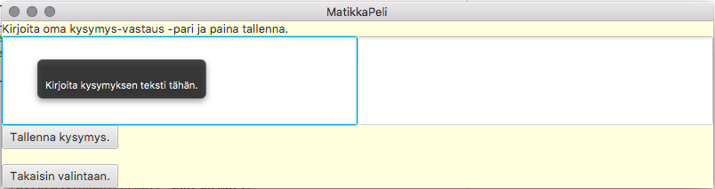

# Käyttöohje

Lataa tiedosto [MatematiikkaSovellus-1.0-SNAPSHOT.jar](https://github.com/heiniauvinen/ot-harjoitustyo/releases/tag/Loppupalautus).

## Ohjelman käynnistäminen

Sovellus käynnistetään komennolla:
```
java -jar MatematiikkaSovellus-1.0-SNAPSHOT.jar
```

## Harjoituksen valinta



Sovellus käynnistyy näkymään, jossa käyttäjä voi valita harjoituksen. 
Harjoitus valitaan painamalla sitä nappia, jonka haluaa suorittaa. 
_Yhteenlaskut_ tai _Vähennyslaskut_ -nappia painamalla voi suorittaa 
yhteen- tai vähennyslaskukokeen omilla asetuksilla. 
_Luo oma kysymys_ -nappia painamalla avautuu näkymä, jossa voi luoda omia kysymyksiä, jotka tallennetaan tietokantaan. 
_Aloita oma koe_ -nappia painamalla voi tehdä omista kysymyksistä koostuvan kokeen.

## Yhteen- ja vähennyslaskuharjoituksen asetukset



Jos on valinnut suoritettavaksi harjoitukseksi yhteen- tai vähennyslaskut, avautuu valinnan jälkeen näkymä, jossa käyttäjä voi asettaa 
harjoituksen luvuille ylä- ja alarajan, jolloin tällä on mahdollisuus 
säätää itse harjoituksen vaativuustasoa. Lisäksi tulee valita kysymysten määrä 
väliltä 1-20. Kun asetukset on käyttäjälle mieluiset, hän pääsee eteenpäin painamalla OK -nappia.

## Yhteen- ja vähennyslaskuharjoituksen harjoitusnäkymä

Asetusten valinnan jälkeen käyttäjälle aukeaa harjoitusnäkymä, joka on joka kerralla 
uniikki. Kun käyttäjä on tehnyt harjoituksen, sovellus tarkistaa oikeiden vastausten määrän.
Tämä tapahtuu painamalla _OK_ -nappia. Tällöin napin viereen ilmestyy tulokset muodossa 
_oikeiden vastausten lukumäärä / kysymysten lukumäärä_.

Käyttäjä pääsee takaisin harjoituksen valintaan painamalla _Takaisin valintaan_ -nappia.
 
## Oman kokeen luominen

Oman kokeen luonti tapahtuu aloitusnäkymässä painamalla _Luo oma kysymys_ -nappia.
Näin aukeaa näkymä, jossa käyttäjä voi tallettaa omia kysymyksiä tietokantaan. 
Jos kysymys- tai vastauskohdassa ei ole tekstiä, tietokantaan ei tallenneta kysymystä, ja sovellus varoittaa tästä.
_Takaisin valintaan_ -nappia painamalla käyttäjä voi palata takaisin aloitussivulle.
Tietokanta säilyttää vanhat kysymykset, joten aloittamalla oman kokeen voit harjoitella myös aiemmin luotuja omia kysymyksiä.



## Oman kokeen tekeminen

Omista kysymyksistä kootun kokeen voi aloittaa painamalla _Aloita oma koe_ -nappia aloitusnäkymässä.
Sovellus arpoo satunnaisessa järjestyksessä itse tehtyjä kysymyksiä. Kokeeseen tulee kuitenkin
maksimissaan 10 kysymystä. 
Painamalla _OK_ -nappia kokeen tulos näytetään kyseisen napin oikealla puolella. 
_Takaisin valintaan_ -nappia painamalla käyttäjä voi palata takaisin aloitussivulle.

