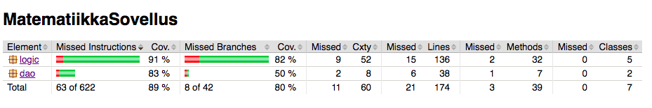

# Testausdokumentti

Ohjelmaa testataan automatisoiduin yksikkö- ja integraatiotestein JUnitilla.
Järjestelmätason testit on tehty kokeilemalla ohjelman käyttämistä.

## Yksikkö- ja integraatiotestaus

### Sovelluslogiikka

Sovelluslogiikkaa testaa JUnit testiluokat _ExamTest_, _ExaminerTest_ ja _PersonalExamTest_. 
Luokka _ExamTest_ testaa samalla myös _Question_ -luokan olioiden toimintaa. 
Testiluokka _PersonalExamTest_ testaa oman kokeen tarkastamisen testeijä varten tarkoitetuilla listoilla. 
Testit on luotu testaamaan realistisia testitapauksia. 

### DAO -luokka

Testiluokassa _CreateDatabaseTest_ luodaan testitietokanta, jonka avulla testataan, toimiiko tietokannan luominen halutusti. 

### Testauskattavuus

Käyttöliittymä poisluettuna sovelluksen testauksen rivikattavuus on 89% ja haarautumakattavuus 80%.

## Järjestelmätestaus

Järjestelmätestaus on suoritettu manuaalisesti.

### Asennus ja konfigurointi

Sovellus on ladattu ja sitä on testattu sovelluksen käyttöohjeen kuvaamalla tavalla OSX- ja Linux Cubbli-ympäristössä.

### Toiminnallisuudet

Määrittelydokumentin ja käyttöohjeen tarjoamat toiminnallisuudet on testattu ja 
niitä on testattu myös virheellisillä syötteillä.

